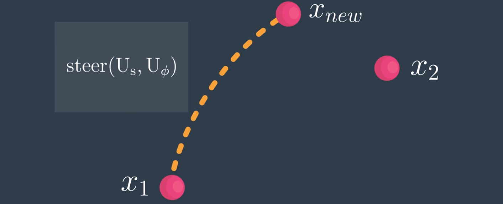

# AAE_Notebook_018_RRT
Now that we've implemented a steer function that, given some start state X1 and some destination state X2, allows us to randomly guess the set of controls that will try to make progress towards X2, we're going to move on an explore Rapidly-Exploring Random Trees (RRTs).

If you're actually randomly sampling controls, most of the time you'll end up with controls that will not give you an edge from X1 to X2; but, you will find an edge from X1 to some sample state we'll call "X-New" paired with the control it took to get there.

The way that the probabilistic roadmap algorithm worked was by sampling all the states first and, then, drawing edges between them. In this case, we're not actually able to build a graph in two steps like that; instead, let's do this iteratively... Let us combine both the state sampling and edge creation.

The steps of the algorithm are as follows:
  1. Sample state
  2. Try to generate steering toward state
  3. Simulate X-New
  4. Add X-New, U-s, and U-phi to graph while discarding original sample state
  5. Iterate

This algorithm is what's known as the Rapidly-Exploring Random Tree, RRT.
